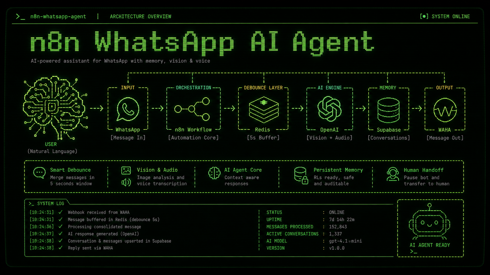

# n8n WhatsApp AI Agent

[](LICENSE)
[](workflow.json)
[](README.md)
[](https://platform.openai.com/docs/models)
[](https://supabase.com/)
[](https://redis.io/)



A production-ready n8n workflow that turns WhatsApp into an AI-powered assistant using WAHA, Redis, OpenAI and Supabase.

Handles message debouncing, image analysis, audio transcription and conversation persistence out of the box.

## Why this matters

Most WhatsApp AI agent examples stop at a simple webhook and a single LLM call. That breaks quickly in real conversations: users send multiple short messages, voice notes, screenshots, images and handoff requests.

This workflow packages the practical pieces needed for a more production-shaped assistant:

- Debounce before the AI answers
- Media understanding before context is built
- Persistent conversation history
- Human handoff support
- A self-hosted WhatsApp path for MVPs and early client pilots

It is meant to be imported, studied, remixed and hardened by the community.

## Quick start

```bash
cp .env.example .env
docker compose up -d
```

Then open n8n at `http://localhost:5678`, import [`workflow.json`](workflow.json), configure the credentials and point WAHA to the n8n webhook URL.

See [`docker-compose.yml`](docker-compose.yml), [`ROADMAP.md`](ROADMAP.md), [`SECURITY.md`](SECURITY.md) and [`CONTRIBUTING.md`](CONTRIBUTING.md) for the full release-ready flow.

## What it does

- **Message debounce** — Buffers rapid-fire messages via Redis and sends a single consolidated prompt to the AI, avoiding duplicate responses and wasted API calls.
- **Vision & audio** — Uses OpenAI models to analyze images and transcribe voice messages before feeding them to the agent context.
- **Persistent memory** — Upserts conversations and messages to Supabase with RLS support, ready for dashboards or human takeover.
- **WhatsApp integration** — Connects through WAHA (WhatsApp Web API) running in Docker, with webhook-based message ingestion.

## Architecture

```
WhatsApp → WAHA Webhook → n8n Workflow
                              │
                    ┌─────────┴─────────┐
                    │   Redis Debounce   │
                    │   (5s buffer)      │
                    └─────────┬─────────┘
                              │
                    ┌─────────┴─────────┐
                    │  Media Processing  │
                    │  (OpenAI Vision)   │
                    └─────────┬─────────┘
                              │
                    ┌─────────┴─────────┐
                    │   AI Agent Core    │
                    │  (gpt-4.1-mini)    │
                    └─────────┬─────────┘
                              │
                    ┌─────────┴─────────┐
                    │  Supabase Sync     │
                    │  (conversations +  │
                    │   messages upsert) │
                    └─────────┬─────────┘
                              │
                    WAHA Reply → WhatsApp
```

## Stack

| Component | Role |
|-----------|------|
| [n8n](https://n8n.io) | Workflow engine |
| [WAHA](https://waha.devlike.pro) | WhatsApp Web API (Docker) |
| [Redis](https://redis.io) | Debounce buffer |
| [OpenAI](https://platform.openai.com/docs/models) | LLM + Vision + Audio |
| [Supabase](https://supabase.com) | Database + Auth + RLS |

## Model strategy

The workflow uses OpenAI by default, with each model chosen for its job:

| Function | Default | Why |
|----------|---------|-----|
| Main WhatsApp agent | `gpt-4.1-mini` | Strong instruction following and tool calling at low cost |
| Image understanding | `gpt-4o-mini` | Fast, affordable vision input for screenshots and photos |
| Audio transcription | OpenAI Transcribe a Recording | Low-friction speech-to-text inside n8n; use `gpt-4o-mini-transcribe` if your n8n version exposes model selection |

If you need maximum quality, upgrade the main agent to `gpt-4.1` or a current GPT-5 family model. For most WhatsApp MVPs, the defaults are the better 80/20 choice.

## Setup

### 1. Create the database tables (Supabase)

Run this in the Supabase SQL Editor:

```sql
CREATE TABLE whatsapp_conversations (
    id UUID DEFAULT gen_random_uuid() PRIMARY KEY,
    chat_id TEXT UNIQUE NOT NULL,
    contact_name TEXT,
    contact_phone TEXT,
    status TEXT DEFAULT 'active',
    created_at TIMESTAMPTZ DEFAULT NOW(),
    updated_at TIMESTAMPTZ DEFAULT NOW()
);

CREATE TABLE whatsapp_messages (
    id UUID DEFAULT gen_random_uuid() PRIMARY KEY,
    conversation_id UUID REFERENCES whatsapp_conversations(id) ON DELETE CASCADE,
    chat_id TEXT NOT NULL,
    role TEXT NOT NULL CHECK (role IN ('user', 'assistant', 'system')),
    content TEXT NOT NULL,
    message_id TEXT,
    created_at TIMESTAMPTZ DEFAULT NOW()
);

CREATE INDEX idx_wpp_messages_chat ON whatsapp_messages(chat_id);
CREATE INDEX idx_wpp_messages_conv ON whatsapp_messages(conversation_id);
```

### 2. Import the workflow

1. Open n8n and create a new workflow.
2. Copy the contents of [`workflow.json`](workflow.json).
3. Paste it into the n8n canvas (or use **Import from File**).

### 3. Start n8n + Redis + WAHA

```bash
cp .env.example .env
docker compose up -d
```

This starts:

- n8n at `http://localhost:5678`
- WAHA at `http://localhost:3000`
- Redis on localhost port `6379`

### 4. Configure credentials in n8n

Replace the placeholder credentials in the imported workflow:

- **Redis** — Host + password
- **Supabase** — Project URL + API key
- **OpenAI** — API key from the [OpenAI platform](https://platform.openai.com/api-keys)
- **WAHA** — API URL + auth token

### 5. Point WAHA webhook to n8n

Set the WAHA webhook to the URL generated by the n8n Webhook node:

- **Event:** `message`
- **URL:** `https://your-n8n.com/webhook/your-path`

Activate the workflow, scan the QR code in WAHA, and the agent is live.

## Why WAHA instead of the official Meta API?

WAHA is a self-hosted WhatsApp Web automation tool. It's ideal for development, testing and early-stage products because it's free and requires no business verification.

The tradeoff: it runs a headless browser session, so it needs session monitoring and periodic WAHA image updates.

Meta doesn't offer a free tier for WhatsApp Cloud API — no sandbox for prototyping without billing. Until that changes, WAHA is the practical choice for getting started.

Once your agent is validated and generating revenue, migrating to the official WhatsApp Cloud API gives you:

- Direct Meta-authorized connection
- 99.9% SLA
- High-throughput messaging without emulation overhead

## Contributing

This project is open for builders who want to improve practical WhatsApp AI agents with n8n.

Good contributions include:

- Better workflow nodes and safer defaults
- WAHA, Supabase, Redis or OpenAI setup improvements
- Production hardening, monitoring and error handling
- Documentation, examples and deployment guides
- Migration paths from WAHA to the official WhatsApp Cloud API

Open an issue with your idea, or send a focused pull request. Keep changes practical, documented and easy to import into n8n.

See [`CONTRIBUTING.md`](CONTRIBUTING.md) for the contribution flow.

## License

MIT

---

If this helped you, consider leaving a ⭐
